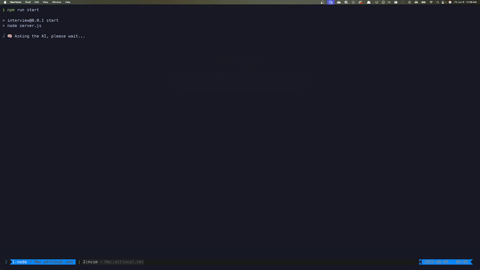

# AI-Powered Appointment Scheduling System

An intelligent appointment scheduling system that uses AI to handle appointment requests, manage availability, and generate calendar events. The system processes natural language requests, checks availability, and maintains appointments in a JSON file.



## Features

- 🤖 AI-powered appointment request processing
- 📅 Natural language date/time parsing
- ✅ Availability checking
- 📝 Calendar event generation
- 📧 Email notifications and reminders
- 🌐 Timezone support (GMT-05:00)
- 💾 Persistent storage using JSON

## Prerequisites

- Node.js (Latest LTS version recommended)
- npm (Node Package Manager)
- API key for AI service (see Configuration)

## Installation

1. Clone the repository:
```bash
git clone <repository-url>
cd <repository-name>
```

2. Install dependencies:
```bash
npm install
```

3. Create a `.env` file in the root directory and add your API key:
```env
KEY_AUTH=your_api_key_here
```

## Configuration

The system uses the following environment variables:
- `KEY_AUTH`: Your API key for the AI service (defaults to a development key if not set)

## Project Structure

- `server.js` - Main application entry point
- `prompt.js` - AI prompt configuration and system instructions
- `addingFile.js` - File operations for appointment storage
- `appointments.json` - Persistent storage for appointments

## Usage

Start the server:
```bash
npm start
```

The system will:
1. Process appointment requests
2. Check availability against existing appointments
3. Generate calendar events with proper metadata
4. Store appointments in `appointments.json`

### Appointment Format

Appointments are stored with the following structure:
```json
{
  "parsed_date": "YY/MM/DD HH:mm",
  "status": "available" | "taken",
  "message": "User-friendly message",
  "calendar_event": {
    "summary": "Appointment title",
    "description": "Appointment details",
    "location": "Meeting location",
    "start": {
      "dateTime": "ISO-8601 datetime",
      "timeZone": "America/Bogota"
    },
    "end": {
      "dateTime": "ISO-8601 datetime",
      "timeZone": "America/Bogota"
    },
    "attendees": [
      { "email": "participant@example.com" }
    ],
    "reminders": {
      "useDefault": false,
      "overrides": [
        { "method": "email", "minutes": 30 },
        { "method": "popup", "minutes": 10 }
      ]
    }
  }
}
```

## Dependencies

- `axios` - HTTP client for API requests
- `convert-time-gmt` - Timezone conversion utilities
- `dotenv` - Environment variable management
- `nodemon` - Development server with auto-reload
- `ora` - Terminal spinner for better UX

## Development

The project uses CommonJS modules and includes development tools:
- `nodemon` for automatic server reloading
- Environment variable support via `dotenv`

## License

MIT License - See LICENSE file for details

## Author

Carlos Gutierrez <carlos.gutierrez@carg.dev> 